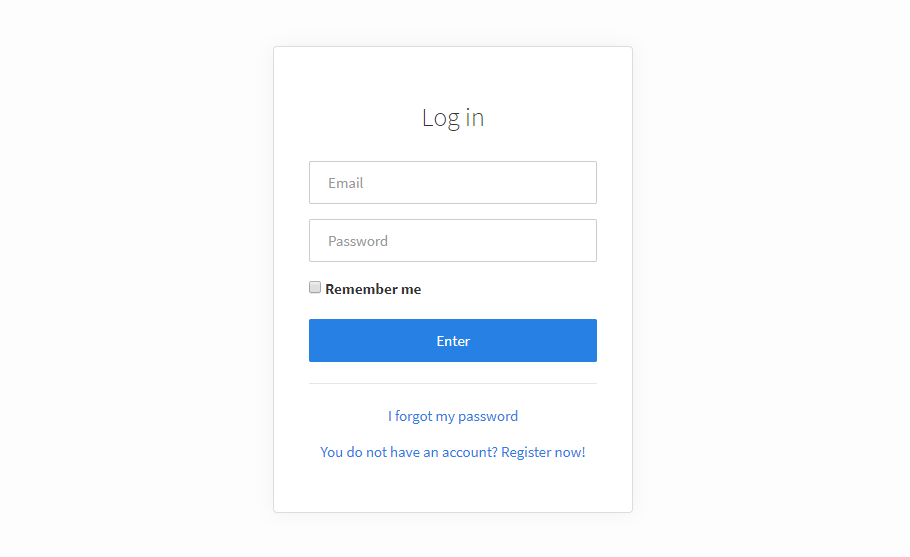

# SimpleAuth

### 内容 Contents

1. 介绍 [Introduction](#introduction)
2. 安装 [Installation](#installation)
   1. 第1步：复制所需的文件 [Step 1: Copy the required files](#step-1-copy-required-files)
   2. 第2步：安装数据库 [Step 2: Install the database](#step-2-install-the-database)
   3. 第3步：定义路线 [Step 3: Define the routes](#step-3-define-the-routes)
3. SimpleAuth控制器 [SimpleAuth Controller](#simpleauth-controller)
   1. 自定义用户注册表单 [Customize the user registration form](#signup-form-personalization)
4. SimpleAuth中间件 [SimpleAuth Middleware](#simpleauth-middleware)
5. SimpleAuth库 [SimpleAuth Library](#simpleauth-library)
   1. 基本功能 [Basic functions](#simpleauth-library-basic-functions)
      1. 获取当前用户 [Obtaining the current user](#obtaining-the-current-user)
      2. 验证用户是否是来宾（匿名） [Verify if a user is a guest (anonymous)](#verifying-if-user-is-guest)
      3. 验证用户的角色 [Verify the role of a user](#verifying-the-user-role)
      4. 验证用户的权限 [Verify the user's permissions](#verifying-the-user-permissions)
   2. 访问控制列表（ACL）功能 [Access Control List (ACL) functions](#simpleauth-library-acl-functions)
   3. 其他功能 [Other functions](#simpleauth-library-other-functions)
6. 意见和翻译 [Views and translations](#views-and-translations)
   1. 设置SimpleAuth外观 [Setting the SimpleAuth skin](#establishing-simpleauth-skin)
   2. 设置SimpleAuth语言 [Setting the SimpleAuth language](#establishing-simpleauth-language)
   3. 使用您自己的观点 [Using your own views](#using-your-own-views)
7. SimpleAuth配置 [SimpleAuth configuration](#simpleauth-configuration)
   1. 一般配置 [General configuration](#general-configuration)
   2. 启用/禁用功能 [Enabling/Disabling features](#enabling-disabling-features)
   3. 视图配置 [Views configuration](#views-configuration)
   4. 访问控制列表（ACL）的配置 [Configuration of Access Control Lists (ACL)](#access-control-list-configuration)
   5. 电子邮件配置 [Email onfiguration](#email-configuration)
   6. 配置“提醒我”功能 [Configuration of the "Remind me" functionality](#remember-me-functionality-configuration)
   7. 数据库配置 [Database configuration](#database-configuration)

### <a name="introduction"></a> 介绍 Introduction

使用SimpleAuth，您可以在不到5分钟的时间内为您的应用程序添加登录和用户注册！SimpleAuth包含一个controller（SimpleAuthController），一个中间件（SimpleAuthMiddleware），一个库（Simple_auth）以及从Luthier CI Authentication Framework构建的其他元素。

### <a name="installation"></a> 安装 Installation

由于安装是通过 [Built-in CLI Tools of Luthier CI](../cli#built-in-cli-tools), 内置CLI工具的命令完成的，因此请务必在路由文件中定义以下命令 `cli .php`:

```php
<?php
# application/routes/cli.php

Luthier\Cli::maker();      // 'luthier make' command
Luthier\Cli::migrations(); // 'luthier migrate' command
```

此外，还必须在启动之前正确配置与数据库（in application/config/database.php）和迁移（in application/config/migration.php）的连接。

#### <a name="step-1-copy-required-files"></a>第1步：复制所需的文件

在应用程序的根文件夹中运行：

```
php index.php luthier make auth
```

如果一切顺利，您应该拥有以下新文件：

```
application
    |- config
    |   |- auth.php
    |
    |- controllers
    |   |- SimpleAuthController.php
    |
    |- libraries
    |   |- Simple_Auth.php
    |
    |- middleware
    |   |- SimpleAuthMiddleware.php
    |
    |- migrations
    |   |- 20180516000000_create_users_table.php
    |   |- 20180516000001_create_password_resets_table.php
    |   |- 20180516000002_create_email_verifications_table.php
    |   |- 20180516000003_create_login_attempts_table.php
    |   |- 20180516000004_create_user_permissions_categories_table.php
    |   |- 20180516000005_create_user_permissions_table.php
    |
    |- security
    |   |- providers
    |       |- User.php
    |       |- UserProvider.php
```

#### <a name="step-2-install-the-database"></a>第2步：安装数据库

在应用程序的根文件夹中运行：

```
php index.php luthier migrate
```

您应该能够看到以下输出：

```
MIGRATED: 20180516000000_create_users_table.php
MIGRATED: 20180516000001_create_password_resets_table.php
MIGRATED: 20180516000002_create_email_verifications_table.php
MIGRATED: 20180516000003_create_login_attempts_table.php
MIGRATED: 20180516000004_create_user_permissions_categories_table.php
MIGRATED: 20180516000005_create_user_permissions_table.php
```

#### <a name="step-3-define-the-routes"></a> 第3步：定义路由

在您的web.php文件中，添加以下行：

```php
Route::auth();
```

这是定义所有这些路线的快捷方式：

```php
Route::match(['get', 'post'], 'login', 'SimpleAuthController@login')->name('login');
Route::post('logout', 'SimpleAuthController@logout')->name('logout');
Route::get('email_verification/{token}', 'SimpleAuthController@emailVerification')->name('email_verification');
Route::match(['get', 'post'], 'signup', 'SimpleAuthController@signup')->name('signup');
Route::match(['get', 'post'], 'confirm_password', 'SimpleAuthController@confirmPassword')->name('confirm_password');
Route::group('password-reset', function(){
    Route::match(['get','post'], '/', 'SimpleAuthController@passwordReset')->name('password_reset');
    Route::match(['get','post'], '{token}', 'SimpleAuthController@passwordResetForm')->name('password_reset_form');
});
```

如果您已正确执行所有步骤，则在访问该URL时，/login您应该会看到新的登录屏幕：



<div class="alert alert-warning">
    <i class="fa fa-warning" aria-hidden="true"></i>
    <strong>有关会话注销路径的信息 </strong>
    <br />
   默认情况下，路由logout仅接受POST请求，因此/logout除非使用指向该路由的HTML表单，否则指向该URL的链接将无法关闭会话。要允许GET请求，请使用Route::auth(FALSE)
</div>

### <a name="simpleauth-controller"></a> SimpleAuth控制器

SimpleAuth控制器（SimpleAuthController）包含身份验证操作，如登录，用户注册，密码重置等。它看起来类似于：

```php
<?php
# application/controllers/SimpleAuthController.php

defined('BASEPATH') OR exit('No direct script access allowed');

/* (...) */

class SimpleAuthController extends Luthier\Auth\SimpleAuth\Controller
{

    /**
     * Sign up form fields
     *
     * (...)
     */
    public function getSignupFields()
    {
        return [ /* (...) */ ];
    }

    /**
     * Fillable database user fields
     *
     * (...)

     * @access public
     */
    public function getUserFields()
    {
        return [ /* (...) */ ];
    }
}
```

除非您想要自定义SimpleAuth，否则您不需要向此驱动程序添加任何其他内容，因为您扩展的类（Luthier\Auth\SimpleAuth\Controller）已经定义了身份验证逻辑，并且在路由文件中Route::auth()已经定义了应该指向此处的所有路由。

<div class="alert alert-warning">
    <i class="fa fa-warning" aria-hidden="true"></i>
    <strong>覆盖方法消除了任何基本功能 </strong>
    <br/>
    它看起来很明显，但是如果你覆盖SimpleAuth驱动程序的任何方法，你将丢失皮肤（主题），翻译视图，用户注册表单构造函数和其他预先配置的有用函数的系统。 ， 如下面所描述的
</div>

#### <a name="signup-form-personalization"></a> 自定义用户注册表单
 (  Customize the user registration form )
您可以根据自己的喜好更改注册表单的字段。为此，getSignupFields()SimpleAuth驱动程序的方法必须返回一个定义其结构的数组，语法如下：

```php
public function getSignupFields()
{
    return [
        'Field name 1' => [
            'Field type',
            'Field label',
            [ /* HTML5 attributes array */ ],
            [ /* CI Validation rules array */] ,
            [ /* CI Validation error essages array (Optional)*/]
        ],
        'Field name 2' => [
            'Field type',
            'Field label',
            [ /* ... */ ],
            [ /* ... */ ] ,
        ],

        // ( ... )

        'Field name N' => [
            'Field type',
            'Field label',
            [ /* ... */ ],
            [ /* ... */ ] ,
        ]
    ];
}
```

另一方面，getUserFields()SimpleAuth驱动程序的方法必须返回一个数组，该数组包含将存储在新用户中的该表单的字段，其中数组的每个元素都匹配该注册表单的字段和名称数据库中users表的列：

```php
public function getUserFields()
{
    return [
        'first_name',
        'last_name',
        'username',
        'gender',
        'email',
        'password',
        'role',
    ];
}
```

Laravel用户会注意到这$fillable与EloquentORM模型的属性完全相同，但应用于SimpleAuth用户注册表单。

### <a name="simpleauth-middleware"></a> SimpleAuth中间件

SimpleAuth中间件 (`SimpleAuthMiddleware`) 是需要用户预身份验证的路由的第一道防线。此中间件自动负责验证用户的当前状态：

* 如果用户已通过身份验证，则请求仍然正常
* 如果用户未经过身份验证，则会尝试使用“记住我”功能（如果已激活）恢复会话
* 如果无法恢复任何先前的会话，则用户将被重定向到登录屏幕

您可以根据需要在尽可能多的路由和路由组中使用SimpleAuth中间件，甚至可以将其与您自己的中间件结合使用，以添加额外的安全层。

例：

```php
<?php
# application/routes/web.php

// SimpleAuth default routes:

Route::auth();

// Public routes:

Route::get('/', 'FrontendController@homepage')->name('homepage');
Route::get('/about', 'FrontendController@about')->name('about');
Route::match(['get','post'], '/contact', 'FrontendController@contact')->name('contact');

// Protected routes: access here without being authenticated will direct to the
//                   login screen

Route::group('dashboard', ['middleware' => ['SimpleAuthMiddleware']], function(){
    Route::get('/', 'UserArea@dashboard');
});
```

### <a name="simpleauth-library"></a> SimpleAuth库

SimpleAuth库是Luthier CI身份验证框架类的包装器，Auth采用本机CodeIgniter库的格式，因此您可以使用您应该已知的语法来使用它的所有方法。

要开始使用SimpleAuth库，您必须将其加载到框架中：

```php
$this->load->library('Simple_auth');
```

#### <a name="simpleauth-library-basic-functions"></a> 基本功能 (  Basic functions )

*注意： `Luthier\Auth` 当您使用SimpleAuth时，并非所有类的方法都相关，因此我们仅列出可能有用的方法*


##### <a name="obtaining-the-current-user"></a>  获取当前用户 ( Obtaining the current user )

要获取在应用程序中进行身份验证的用户，请使用user()返回用户对象的方法，或者NULL如果不存在经过身份验证的用户：

```php
// The current user object:
$userObject = $this->simple_auth->user();

// With the user object you have access to:
// ...the user entity of the database:
$user = $userObject->getEntity();

// ...their roles:
$roles = $userObject->getRoles();

// ...and its permissions:
$permissions = $userObject->getPermissions();
```

如果您使用默认的SimpleAuth用户提供程序，则可以直接访问当前用户的数据，而无需使用该getEntity()方法。以下表达式是等效的：

```php
$this->simple_auth->user()->getEntity()->first_name;

$this->simple_auth->user()->first_name;
```

##### <a name="verifying-if-user-is-guest"></a> 验证用户是否是来宾（匿名） Verify if a user is a guest (anonymous)

要快速验证用户是否被邀请，请使用该isGuest()方法，TRUE如果用户尚未登录，则返回该方法，FALSE否则：

```php
$this->simple_auth->isGuest();
```

##### <a name="verifying-the-user-role"></a> 验证用户的角色 Verify the role of a user

要验证用户是否具有特定角色，请使用该方法isRole($role)，TRUE如果用户具有该角色$role，或者FALSE如果他不拥有该角色，或者没有经过身份验证的用户，则使用该方法：

```php
$this->simple_auth->isRole('ADMIN');
```

##### <a name="verifying-the-user-permissions"></a> 验证用户的权限 Verify the user's permissions

要验证用户是否具有特定权限，请使用该方法isGranted($permission)，该方法TRUE在用户具有权限时返回permission，或者FALSE如果用户没有该权限，或者没有经过身份验证的用户

例：

```php
$this->simple_auth->isGranted('general.read');
```

可以使用替代语法来验证用户是否属于以特定短语/类别开头的角色：

```php
// The following will give TRUE for permits that begin with 'general.'
$this->simple_auth->isGranted('general.*');
```

#### <a name="simpleauth-library-acl-functions"></a> 访问控制列表（ACL）功能  Access Control List (ACL) functions

访问控制列表（ACL）是一种可选的身份验证功能，用于为每个经过身份验证的用户设置特定权限。因此，用户可以具有角色和若干分配的权限，以保证（或拒绝）访问应用程序的某些资源。

在SimpleAuth中没有用户组或类似的东西，用户权限存储在变量深度权限树中（子权限限制取决于您）。

请考虑以下权限：

```
ID      NAME        PARENT_ID
-----------------------------
1       general     [null]
2       read        1
3       write       1
4       delete      1
5       local       4
6       global      4
```

这个权限分配：

```
ID      USERNAME    PERMISSION_ID
---------------------------------
1       anderson    2
2       anderson    5
3       julio       3
4       julio       6
```

例如，当用户anderson登录时，您将拥有以下权限：

```
general.read
general.delete.local
```

当用户julio登录时，他将拥有以下权限：

```
general.write
general.delete.global
```

权限树存储在user_permissions_categories表中，而权限分配存储在user_permissions表中，两者都由SimpleAuth中包含的迁移创建。没有自动创建或删除权限的方法，因此您必须手动执行此操作。

---

这些是SimpleAuth库中可用的ACL函数：

##### <a name="simpleauth-library-permissionsexists-method"></a> permissionsExists(*string* **$permission**) *: [bool]*

验证$permission访问控制列表（ACL）表中是否存在权限。

例：

```php
$this->simple_auth->permissionExists('general.read');
```

##### <a name="simpleauth-library-grantpermission-method"></a> grantPermission(*string* **$permission**, *string* **$username** = *NULL*) *: [bool]*

将权限分配$permission给用户$username，TRUE如果操作成功FALSE则返回。

```php
// Assigning the 'general.read' permission to the current user
$this->simple_auth->grantPermission('general.read');
```

##### <a name="simpleauth-library-revokepermission-method"></a> revokePermission(*string* **$permission**, *string* **$username** = *NULL*) *: [bool]*

撤消对$permission用户的权限$username，TRUE如果操作成功或FALSE以其他方式返回。

```php
// Revoking the 'general.read' permission to the current user
$this->simple_auth->revokePermission('general.read');
```

#### <a name="simpleauth-library-other-functions"></a>  其他功能 Other functions

以下功能对于与用户身份验证相关的特殊任务非常有用：

##### <a name="simpleauth-library-isfullyauthenticated-method"></a> isFullyAutenticated() *: [bool]*

TRUE如果用户完全通过身份验证，FALSE则返回。完全通过身份验证的用户是直接登录而不是通过“记住我”功能登录的用户。

##### <a name="simpleauth-library-promptpassword-method"></a> promptPassword(*string* **$route** = `'confirm_password'`) *: [bool]*

$route如果用户未完全通过身份验证，则会自动重定向到路径。此功能对于通过“记住我”功能再次请求经过身份验证的用户确认密码非常有用。

##### <a name="simpleauth-library-searchuser-method"></a> searchUser(*mixed* **$search**) *: [object|null]*

返回在标准下找到的用户的对象$search，或者NULL如果找不到任何对象。根据变量的类型$search，此方法执行三种类型的搜索：

* **int**: 它将使用匹配的主键（配置simpleauth_id_col）搜索并返回用户
* **string**: 它将在登录期间搜索并返回与用户名列集值匹配的第一个用户（配置simpleauth_username_col）
* **array**: 它等同于where($search)CodeIgniter QueryBuilder 的方法。

例：

```php
// It will search the user with ID 1
$this->simple_auth->searchUser(1);

// It will search the user with the username/email column equal to 'admin@admin.com'
$this->simple_auth->searchUser('admin@admin.com');

// It will search for the user whose column value 'gender' is 'm' and 'active' is equal to 1
$this->simple_auth->searchUser(['gender' => 'm', 'active' => 1]);
```

##### <a name="simpleauth-library-updateuser-method"></a> updateUser(*int|string* **$search**) *: [void]*

更新在$search标准下找到的用户。根据变量的类型$search，此方法执行两种不同类型的更新：

* **int**: 将使用匹配的主键值（配置simpleauth_id_col）搜索和更新第一个用户
* **string**: 将匹配登录期间为用户名设置的列值搜索并更新第一个用户（配置simpleauth_username_col）

例：
```php
// It will replace the user's data with ID 1
$this->simple_auth->updateUser(1, ['first_name' => 'John']);

// It will replace the user's data with the user name / email column equal to 'admin@admin.com'
$this->simple_auth->searchUser('admin@admin.com', ['gender' => 'f']);
```

##### <a name="simpleauth-library-createuser-method"></a> createUser(*array* **$data**) *: [void]*

使用$data数组的值在数据库中创建新用户。$data数组的每个索引对应于用户表中的一个列，在simpleauth_users_table配置中定义

例：

```php
$this->simple_auth->createUser(
    [
        'first_name' => 'Admin',
        'last_name'  => 'Admin',
        'username'   => 'admin',
        'email'      => 'admin@admin.com',
        'password'   => 'admin',
        'gender'     => 'm',
        'role'       => 'admin',
        'verified'   => 1
    ]
);
```

如果列的名称与simpleauth_password_col配置中设置的名称匹配，则此函数会自动创建密码哈希

### <a name="views-and-translations"></a> 意见和翻译 Views and translations

SimpleAuth使您可以在预定的设计（皮肤）之间进行选择或使用您自己的视图。SimpleAuth中包含的设计具有翻译成多种语言的优点。目前，支持的语言如下：

* English
* Spanish

#### <a name="establishing-simpleauth-skin"></a> 设置SimpleAuth外观 Setting the SimpleAuth skin

要更改视图中使用的外观，请修改simpleauth_skinSimpleAuth配置文件中的选项：

```php
# application/config/auth.php

$config['simpleauth_skin'] = 'default';
```

#### <a name="establishing-simpleauth-language"></a> 设置SimpleAuth语言 Setting the SimpleAuth language

外观使用的语言取决于framework（）主配置文件的languageoption（$config['language']）的值application/config/config.php。如果在SimpleAuth支持的语言中找不到当前语言，english则将使用English（）。

#### <a name="using-your-own-views"></a> 使用您自己的观点 Using your own views

您可以使用自己的视图，而无需覆盖SimpleAuth驱动程序方法。SimpleAuth总共使用了6个视图：

* **login.php**: 登录视图
* **signup.php**: 用户注册视图
* **password_prompt.php**: 当前密码确认视图（“提醒我”功能）    
* **password_reset.php**: 密码重置请求表单的视图
* **password_reset_form.php**: 密码重置表单的视图
* **message.php**: 通用消息的视图

因此，要使用您自己的视图，只需在文件夹中创建一个文件，其中包含要替换的视图的名称simpleauth（如果它不存在，您必须先创建它）views。例如：

```php
application/views/simpleauth/login.php
application/views/simpleauth/message.php
application/views/simpleauth/password_prompt.php
application/views/simpleauth/password_reset.php
application/views/simpleauth/password_reset_form.php
application/views/simpleauth/signup.php
```

### <a name="simpleauth-configuration"></a> SimpleAuth配置 SimpleAuth configuration

SimpleAuth配置位于application/config/auth.php文件中。接下来，简要说明每个元素：

#### <a name="general-configuration"></a> General configuration

* **auth_login_route**: *[string]*登录路径。如果使用该Route::auth()方法定义SimpleAuth路由，则将忽略此值。
* **auth_logout_route**: *[string]* 注销路径。如果使用该Route::auth()方法定义SimpleAuth路由，则将忽略此值。
* **auth_login_route_redirect**: *[string]* 成功登录时的重定向路径
* **auth_logout_route_redirect**: *[string]* 注销后立即重定向路径。
* **auth_route_auto_redirect**: *[array]*  `auth_login_route_redirect`在用户已经过身份验证的情况下将激活自动重定向到路径的路由。
* **auth_form_username_field**: *[string]* 与要进行身份验证的用户名/电子邮件对应的登录表单字段的名称。
* **auth_form_username_field**: *[string]* 与要验证的用户密码对应的登录表单字段的名称。
* **auth_session_var**: *[string]* Luthier CI身份验证模块使用的会话变量的名称。

#### <a name="enabling-disabling-features"></a> 启用/禁用功能 Enabling/Disabling features

* **simpleauth_enable_signup**: *[bool]* 激活用户注册表单。
* **simpleauth_enable_password_reset**: *[bool]* 激活密码重置表单。
* **simpleauth_enable_remember_me**: *[bool]* 根据cookie激活“记住我”功能。
* **simpleauth_enable_email_verification**: *[bool]* 在用户注册过程中激活电子邮件验证。要使其正常工作，必须正确配置框架的电子邮件。
* **simpleauth_enforce_email_verification**: *[bool]* 当此选项TRUE为时，SimpleAuth将拒绝登录没有经过验证的电子邮件帐户的用户。
* **simpleauth_enable_brute_force_protection**: *[bool]* 启用暴力登录攻击防御。
* **simpleauth_enable_acl**: *[bool]* 激活访问控制列表（ACL）

#### <a name="views-configuration"></a>  视图配置 Views configuration

* **simpleauth_skin**: *[string]* SimpleAuth包含的视图中使用的皮肤。默认情况下是default。
* **simpleauth_assets_dir**: *[string]* 相对于将保存SimpleAuth视图的资源（css，js等）的应用程序的公共URL。

#### <a name="access-control-list-configuration"></a> 访问控制列表（ACL）的配置 Configuration of Access Control Lists (ACL)

* **simpleauth_acl_map**: *[array]* 与访问控制列表使用的类别和权限类别组的名称和ID的关联排列。配置这会大大减少数据库中的查询数量，尤其是当您拥有深度权限树时。

#### <a name="email-configuration"></a> 电子邮件配置 Email configuration

* **simpleauth_email_configuration**: *[array | null]* 使用在SimpleAuth电子邮件的电子邮件库初始化期间提供的自定义配置进行修复。请null继续使用相同的应用程序。
* **simpleauth_email_address**: *[string]* 将出现在fromSimpleAuth发送的电子邮件字段中的电子邮件地址。
* **simpleauth_email_name**: *[string]* 将出现from在SimpleAuth发送的电子邮件中字段旁边的名称。
* **simpleauth_email_verification_message**: *[string | null]*自动消息，其中包含在应用程序中成功注册后发送给用户的电子邮件验证说明。保留它null以使用默认的SimpleAuth消息，该消息被转换为应用程序的当前语言。注意：为了正确显示包含HTML的邮件，必须首先配置电子邮件库。
* **simpleauth_password_reset_message**: *[string | null]*带有密码重置说明的自动消息。保留null使用转换为应用程序当前语言的默认SimpleAuth消息。注意：为了正确显示包含HTML的邮件，必须首先配置电子邮件库。

#### <a name="remember-me-functionality-configuration"></a>配置“提醒我”功能  Configuration of the "Remind me" functionality

* **simpleauth_remember_me_field**: *[string]* 与“提醒我”功能对应的登录表单的字段名称。
* **simpleauth_remember_me_cookie**: *[string]* 用于“提醒我”功能的cookie的名称。

#### <a name="database-configuration"></a>数据库配置 Database configuration

* **simpleauth_user_provider**: *[string]* SimepleAuth使用的用户提供程序。    
* **simpleauth_users_table**: *[string]* 存储用户的表的名称。
* **simpleauth_users_email_verification_table**: *[string]* 存储电子邮件验证令牌的表的名称。
* **simpleauth_password_resets_table**: *[string]* 存储密码重置令牌的表的名称。
* **impleauth_login_attempts_table**: *[string]* 存储登录尝试失败的表的名称，用于防御暴力登录攻击。
* **simpleauth_users_acl_table**: *[string]* 存储授予的用户权限的表的名称，由访问控制列表（ACL）使用。
* **simpleauth_users_acl_categories_table**: *[string]*存储访问控制列表（ACL）使用的权限树的表的名称。
* **simpleauth_id_col**: *[string]* 用户表的标识列的名称。
* **simpleauth_username_col**: *[string]* 与用户表的用户名对应的列的名称。此列是在用户身份验证过程中使用的列。
* **simpleauth_email_col**: *[string]* 与用户表的电子邮件对应的列的名称。此列是将用于来自库的电子邮件的列。
* **simpleauth_email_first_name_col**: *[string]* 与用户表的名字（或名称）对应的列的名称。此列是将用于来自库的电子邮件的列。
* **simpleauth_password_col**: *[string]* 相应列的名称，用户表中的密码。此列是在用户身份验证过程中使用的列。
* **simpleauth_role_col**: *[string]* 与用户表中的角色对应的列的名称。此列将用于检查库中的用户角色。
* **simpleauth_active_col**: *[string]* 与用户状态对应的列的名称。在数据库中，它必须定义为INT类型的列，其中值0对应于禁用的用户和激活1的用户。它在登录会话期间使用。
* **simpleauth_verified_col**: *[string]* 与用户电子邮件的验证状态对应的列的名称。在数据库中，它必须定义为INT类型的列，其中值0对应于禁用的用户和激活1的用户。它在登录会话期间使用。
* **simpleauth_remember_me_col**: *[string]* 存储“记住我”功能使用的令牌的列的名称（如果已激活）。