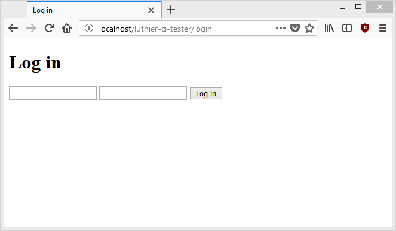

# Luthier CI 认证框架  (  Authentication Framework  )

### 内容 Contents

1. 介绍 [Introduction](#introduction)
2. 创建用户提供商 [Creation of User Providers](#creation-of-user-providers)
   1. 用户实例 [User instance](#user-instance)
   2. 用户加载 [Users load](#user-load)
   3. 密码哈希及其验证 [Password hash and its verification](#password-hash-and-verification)
   4. 验证用户是否处于活动状态并已验证 [Validate that a user is active and verified](#validate-that-an-user-is-active-and-verified)
3. 与用户提供商合作 [Working with User Providers](#working-with-user-providers)
   1. 用户登录 [User login](#user-login)
   2. 高级用户登录 [Advanced user login](#advanced-user-login)
4. 会话 [Sessions](#sessions)
   1. 在会话中存储用户 [Storing a user in the session](#storing-an-user-in-the-session)
   2. 从会话中检索用户 [Retrieving a user from the session](#retrieving-an-user-from-the-session)
   3. 自定义会话数据 [Custom session data](#custom-session-data)
   4. 删除当前会话 [Deleting the current session](#deleting-custom-session)
5. 用户操作 [User Operations](#user-operations)
   1. 角色验证 [Roles verification](#roles-verification)
   2. 权限验证 [Permissions verification](#permissions-verification)
6. 基于控制器的认证 [Controller-based authentication](#controller-based-authentication)
   1. 一般配置 [General configuration](#general-configuration)
   2. 身份验证控制器 [The authentication controller](#the-authentication-controller)
   3. 登录表单 [The login form](#the-login-form)
   4. 登出 [Log out](#logout)
   5. 认证事件 [Authentication events](#authentication-events)

### <a name="introduction"></a> 介绍 Introduction

**Luthier CI Authentication Framework** 是哪个用户认证系统是建立在笨的结构。它提供了两个主要困境的答案：从中获取用户以及在应用程序中如何使用这些困境。

在此过程中使用用户提供程序。用户提供程序是一个类，负责从某个地方获取经过身份验证的用户，作为CodeIgniter之间的中介，例如，数据库，API或甚至加载到内存中的用户数组。

本文针对高级用户并具有非常特定的身份验证需求。如果您正在寻找预先配置且易于使用的解决方案，请参阅SimpleAuth的文档，事实上，这是您将在下面阅读的所有内容的实现。

### <a name="creation-of-user-providers"></a>创建用户提供商 Creation of User Providers

所有用户提供商都存储在该application/security/providers文件夹中。此外，您的类必须实现Luthier\Auth\UserProviderInterface接口，该接口定义以下方法：

```php
public function getUserClass();

public function loadUserByUsername($username, $password = null);

public function hashPassword($password);

public function verifyPassword($password, $hash);

public function checkUserIsActive(UserInterface $user);

public function checkUserIsVerified(UserInterface $user);
```

让我们首先创建一个名为的文件MyUserProvider.php，它将成为我们的第一个用户提供者：

```php
<?php
# application/security/providers/MyUserProvider.php

use Luthier\Auth\UserProviderInterface;

class MyUserProvider implements UserProviderInterface
{

}
```

#### <a name="user-instance"></a> 用户实例 User instance

该用户实例是通过认证的用户的逻辑表示：它们包含（和返回）所有的细节，角色和权限。我们必须在User Provider中实现的第一个方法是getUserClass()返回从现在开始使用的用户实例的名称。

我们将调用我们的用户实例MyUser，然后：

```php
<?php
# application/security/providers/MyUserProvider.php

use Luthier\Auth\UserProviderInterface;

class MyUserProvider implements UserProviderInterface
{
    public function getUserClass()
    {
        return 'MyUser';
    }
}
```

下一步是创建类MyUser。用户实例文件保存在application/security/providers文件夹中。为了让Luthier CI使用它们，类的名称和文件名必须与getUserClass()方法中返回的名称相匹配。

用户实例必须实现Luthier\Auth\UserInterface接口，该接口定义以下方法：

```php
public function __construct($instance, $roles, $permissions);

public function getEntity();

public function getUsername();

public function getRoles();

public function getPermissions();
```

实现所有这些方法，我们的MyUser类看起来像这样：

```php
<?php
# application/security/providers/MyUser.php

use Luthier\Auth\UserInterface;

class MyUser implements UserInterface
{
    private $user;

    private $roles;

    private $permissions;

    public function __construct($entity, $roles, $permissions)
    {
        $this->user        = $entity;
        $this->roles       = $roles;
        $this->permissions = $permissions;
    }

    public function getEntity()
    {
        return $this->user;
    }

    public function getUsername()
    {
        return $this->user->email;
    }

    public function getRoles()
    {
        return $this->roles;
    }

    public function getPermissions()
    {
        return $this->permissions;
    }
}
```

我们的文件结构如下：

```
application
    |- security
    |   |- providers
    |       | - MyUserProvider.php
    |       | - MyUser.php
```

#### <a name="user-load"></a> 用户加载  Users load

必须从某个地方获取用户，并且要实现以下方法，才能实现loadUserByUsername()该功能。

用户加载只有两种可能的结果：

* **Successful load**: 找到匹配的用户名和密码。User Provider返回表示用户的对象。
* **Failed load**: 未找到用户。以下任何异常抛出：UserNotFoundException，InactiveUserException，UnverifiedUserException或PermissionNotFoundException。

最简单的示例是在同一个User Provider中声明一个数组，其中包含可用的用户：

```php
$users = [
    [
        'name'      => 'John Doe',
        'email'     => 'john@doe.com',
        'password'  => 'foo123',
        'active'    => 1,
        'verified'  => 1,
    ],
    [
        'name'      => 'Alice Brown',
        'email'     => 'alice@brown.com',
        'password'  => 'bar456',
        'active'    => 1,
        'verified'  => 1,
    ]
];
```

话虽如此，我们将使用以下代码更新代码：

```php
<?php
# application/security/providers/MyUserProvider.php

use Luthier\Auth\UserInterface;
use Luthier\Auth\UserProviderInterface;
use Luthier\Auth\Exception\UserNotFoundException;

class MyUserProvider implements UserProviderInterface
{
    public function getUserClass()
    {
        return 'MyUser';
    }

    public function loadUserByUsername($username, $password = null)
    {
        $users = [
            [
                'name'      => 'John Doe',
                'email'     => 'john@doe.com',
                'password'  => 'foo123',
                'active'    => 1,
                'verified'  => 1,
            ],
            [
                'name'      => 'Alice Brown',
                'email'     => 'alice@brown.com',
                'password'  => 'bar456',
                'active'    => 1,
                'verified'  => 1,
            ]
        ];

        $userEmails   = array_column($users, 'email');
        $foundedIndex = array_search($username, $userEmails);

        if($foundedIndex === false)
        {
            throw new UserNotFoundException('Invalid user credentials!');
        }

        $user = (object) $users[$foundedIndex];

        if($user->password != $password)
        {
            throw new UserNotFoundException('Invalid user credentials!');
        }

        $userClass = $this->getUserClass();

        return new $userClass(
            /*  User data   */ $user,
            /*     Roles    */ ['user'],
            /*  Permissions */ []
        );
    }
}
```

现在，我们的用户提供程序能够搜索数组并在匹配时返回用户对象，或者如果找不到用户则抛出UserNotFoundException异常。但是，作为一般规则，密码通常不会（也不应该）直接存储。

相反，存储使用单向加密算法生成的哈希。考虑这个新用户数组：

```php
$users = [
    [
        'name'      => 'John Doe',
        'email'     => 'john@doe.com',
        'password'  => '$2y$10$c1iqXvXuFKZ4hI4l.LhCvuacba1fR3OX.uPfPD29j4DkyayC6p4uu',
        'active'    => 1,
        'verified'  => 1,
    ],
    [
        'name'      => 'Alice Brown',
        'email'     => 'alice@brown.com',
        'password'  => '$2y$10$xNHf.J7fbNdph2dy26JAdeQEA70aL/SG9ojrkpR3ocf1qph0Bafay',
        'active'    => 1,
        'verified'  => 1,
    ]
];
```

每一个的密码仍然完全相同，不同的是现在存储的是你的哈希而不是纯文本的密码，

所以比较`$user-> password == $password` 是不够的。

#### <a name="password-hash-and-verification"></a> 密码哈希及其验证

要实现的以下方法负责在用户提供程序中生成和验证密码哈希：

* `hashPassword()`: *[string]* 以纯文本形式接收密码并返回其哈希值

* `verifyPassword()`: *[bool]* ]以纯文本和密码哈希方式接收密码，验证它们是否匹配

逻辑和实现由开发人员自行决定。在我们的例子中，我们将使用blowfish算法，留下如下代码：

```php
<?php
# application/security/providers/MyUserProvider.php

use Luthier\Auth\UserInterface;
use Luthier\Auth\UserProviderInterface;
use Luthier\Auth\Exception\UserNotFoundException;

class MyUserProvider implements UserProviderInterface
{
    public function getUserClass()
    {
        return 'MyUser';
    }

    public function loadUserByUsername($username, $password = null)
    {
        $users = [
            [
                'name'      => 'John Doe',
                'email'     => 'john@doe.com',
                'password'  => '$2y$10$c1iqXvXuFKZ4hI4l.LhCvuacba1fR3OX.uPfPD29j4DkyayC6p4uu',
                'active'    => 1,
                'verified'  => 1,
            ],
            [
                'name'      => 'Alice Brown',
                'email'     => 'alice@brown.com',
                'password'  => '$2y$10$xNHf.J7fbNdph2dy26JAdeQEA70aL/SG9ojrkpR3ocf1qph0Bafay',
                'active'    => 1,
                'verified'  => 1,
            ]
        ];

        $userEmails   = array_column($users, 'email');
        $foundedIndex = array_search($username, $userEmails);

        if($foundedIndex === false)
        {
            throw new UserNotFoundException('Invalid user credentials!');
        }

        $user = (object) $users[$foundedIndex];

        if(!$this->verifyPassword($password, $user->password))
        {
            throw new UserNotFoundException('Invalid user credentials!');
        }

        $userClass = $this->getUserClass();

        return new $userClass(
            /*  User data   */ $user,
            /*     Roles    */ ['user'],
            /*  Permissions */ []
        );
    }

    public function hashPassword($password)
    {
        return password_hash($password, PASSWORD_DEFAULT);
    }

    public function verifyPassword($password, $hash)
    {
        return password_verify($password, $hash);
    }
}
```

您可能已经注意到$password该loadUserByUsername()方法的参数必须定义为可选参数。这是因为在每个请求开始时，Luthier CI会尝试使用其用户Provider重新加载最后一个经过身份验证的用户，这只有在可以从会话中相对安全的数据存储中获取用户时才有可能，例如ID或用户名。

因此，我们必须稍微修改我们的代码，以确保即使没有提供密码，用户提供商仍然能够获得用户：

```php
<?php
# application/security/providers/MyUserProvider.php

use Luthier\Auth\UserInterface;
use Luthier\Auth\UserProviderInterface;
use Luthier\Auth\Exception\UserNotFoundException;

class MyUserProvider implements UserProviderInterface
{
    public function getUserClass()
    {
        return 'MyUser';
    }

    public function loadUserByUsername($username, $password = null)
    {
        $users = [
            [
                'name'      => 'John Doe',
                'email'     => 'john@doe.com',
                'password'  => '$2y$10$c1iqXvXuFKZ4hI4l.LhCvuacba1fR3OX.uPfPD29j4DkyayC6p4uu',
                'active'    => 1,
                'verified'  => 1,
            ],
            [
                'name'      => 'Alice Brown',
                'email'     => 'alice@brown.com',
                'password'  => '$2y$10$xNHf.J7fbNdph2dy26JAdeQEA70aL/SG9ojrkpR3ocf1qph0Bafay',
                'active'    => 1,
                'verified'  => 1,
            ]
        ];

        $userEmails   = array_column($users, 'email');
        $foundedIndex = array_search($username, $userEmails);

        if($foundedIndex === false)
        {
            throw new UserNotFoundException('Invalid user credentials!');
        }

        $user = (object) $users[$foundedIndex];

        if($password !== NULL)
        {
            if(!$this->verifyPassword($password, $user->password))
            {
                throw new UserNotFoundException('Invalid user credentials!');
            }
        }

        $userClass = $this->getUserClass();

        return new $userClass(
            /*  User data   */ $user,
            /*     Roles    */ ['user'],
            /*  Permissions */ []
        );
    }

    public function hashPassword($password)
    {
        return password_hash($password, PASSWORD_DEFAULT);
    }

    public function verifyPassword($password, $hash)
    {
        return password_verify($password, $hash);
    }
}
```

<div class="alert alert-danger">
    <i class="fa fa-times" aria-hidden="true"></i>
    <strong>不要使用md5（）或sha1（）函数进行密码哈希 </strong>
    <br />
   这些算法非常有效，任何人（使用现代计算机和足够的空闲时间）都可以尝试通过暴力破解加密。有一节介绍了PHP文档中的<a href="http://php.net/manual/es/faq.passwords.php">password hashes</a> ，对于那些担心安全性这一重要方面的人来说，毫无疑问是必读的。
</div>


#### <a name="validate-that-an-user-is-active-and-verified"></a> 验证用户是否处于活动状态并已验证

这一切仍然是执行方法checkUserIsActive()和checkUserIsVerified()，正如它们的名字，验证用户是主动和他们的信息被验证。

您可以选择激活和验证用户的条件。在我们的例子中，对于要激活的用户，其值active必须等于1，并且要验证它的值verified必须等于1。

通过实现这两种方法，我们的用户提供程序现在如下所示：

```php
<?php
# application/security/providers/MyUserProvider.php

use Luthier\Auth\UserInterface;
use Luthier\Auth\UserProviderInterface;
use Luthier\Auth\Exception\UserNotFoundException;
use Luthier\Auth\Exception\InactiveUserException;
use Luthier\Auth\Exception\UnverifiedUserException;

class MyUserProvider implements UserProviderInterface
{
    public function getUserClass()
    {
        return 'MyUser';
    }

    public function loadUserByUsername($username, $password = null)
    {
        $users = [
            [
                'name'      => 'John Doe',
                'email'     => 'john@doe.com',
                'password'  => '$2y$10$c1iqXvXuFKZ4hI4l.LhCvuacba1fR3OX.uPfPD29j4DkyayC6p4uu',
                'active'    => 1,
                'verified'  => 1,
            ],
            [
                'name'      => 'Alice Brown',
                'email'     => 'alice@brown.com',
                'password'  => '$2y$10$xNHf.J7fbNdph2dy26JAdeQEA70aL/SG9ojrkpR3ocf1qph0Bafay',
                'active'    => 1,
                'verified'  => 1,
            ]
        ];

        $userEmails   = array_column($users, 'email');
        $foundedIndex = array_search($username, $userEmails);

        if($foundedIndex === false)
        {
            throw new UserNotFoundException('Invalid user credentials!');
        }

        $user = (object) $users[$foundedIndex];

        if($password !== NULL)
        {
            if(!$this->verifyPassword($password, $user->password))
            {
                throw new UserNotFoundException('Invalid user credentials!');
            }
        }

        $userClass = $this->getUserClass();

        return new $userClass(
            /*  User data   */ $user,
            /*     Roles    */ ['user'],
            /*  Permissions */ []
        );
    }

    public function hashPassword($password)
    {
        return password_hash($password, PASSWORD_DEFAULT);
    }

    public function verifyPassword($password, $hash)
    {
        return password_verify($password, $hash);
    }

    final public function checkUserIsActive(UserInterface $user)
    {
        /*
         * The getEntity() method is used to return an array / object / entity with the
         * user data. In our case, it is an object, so we can use
         * the following chained syntax:
         */
        if($user->getEntity()->active == 0)
        {
            throw new InactiveUserException();
        }
    }


    final public function checkUserIsVerified(UserInterface $user)
    {
        /*
         * The same here:
         */
        if($user->getEntity()->verified == 0)
        {
            throw new UnverifiedUserException();
        }
    }
}
```

完成！您已经创建了第一个用户提供程序和附加的用户实例。您已准备好对用户进行身份验证。

### <a name="working-with-user-providers"></a> 与用户提供商合作

在使用用户提供程序之前，您应该做的第一件事是将其上传到您的应用程序。为此，请使用类的静态loadUserProvider()方法Auth。

例如，要加载以前的User Provider，语法如下：

```php
$myUserProvider = Auth::loadUserProvider('MyUserProvider');
```

#### <a name="user-login"></a> 用户登录

要执行登录，请使用loadUserByUsername()User Provider 的方法，其中第一个参数是用户名/电子邮件，第二个参数是您的密码：

```php
// We load a User Provider:
$myUserProvider = Auth::loadUserProvider('MyUserProvider');

// Returns the user object corresponding to 'john@doe.com':
$john = $myUserProvider->loadUserByUsername('john@doe.com', 'foo123');

// Returns the corresponding user object to 'alice@brown.com':
$alice = $myUserProvider->loadUserByUsername('alice@brown.com', 'bar456');
```

用户提供程序的设计使得只能使用用户名/电子邮件登录：

```php
$alice = $myUserProvider->loadUserByUsername('alice@brown.com');
```

登录期间的任何错误都会产生异常，应根据具体情况捕获并处理：

```php
// ERROR: The password of john@doe.com is incorrect!
// (An exception 'UserNotFoundException' will be thrown)
$jhon = $myUserProvider->loadUserByUsername('john@doe.com', 'wrong123');

// ERROR: The user anderson@example.com doesn't exist!
// (An exception 'UserNotFoundException' will be thrown)
$anderson = $myUserProvider->loadUserByUsername('anderson@example.com', 'test123');
```

#### <a name="advanced-user-login"></a> 高级用户登录

该用户提供返回用户，但这并不意味着他们真的有权登录。checkUserIsActive()和checkUserIsVerified()方法添加方便额外的检查。

考虑以下用户数组：

```php
$users = [
    [
        'name'      => 'Alex Rodriguez',
        'email'     => 'alex@rodriguez.com',
        'password'  => '$2y$10$2nXHy1LyNL217hfyINGKy.Ef5uhxa1FdmlMDw.nbGOkSEJtT6IJWy',
        'active'    => 0,
        'verified'  => 1,
    ],
    [
        'name'      => 'Alice Brown',
        'email'     => 'alice@brown.com',
        'password'  => '$2y$10$xNHf.J7fbNdph2dy26JAdeQEA70aL/SG9ojrkpR3ocf1qph0Bafay',
        'active'    => 1,
        'verified'  => 0,
    ],
    [
        'name'      => 'Jessica Hudson',
        'email'     => 'jessica@example.com',
        'password'  => '$2y$10$IpNrG1VG53DrborE4Tl6LevtVgVfoO9.Ef9TBVgH9I10DLRnML9gi',
        'active'    => 1,
        'verified'  => 1,
    ],
];
```

以下登录代码：

```php
use Luthier\Auth\Exception\UserNotFoundException;
use Luthier\Auth\Exception\InactiveUserException;
use Luthier\Auth\Exception\UnverifiedUserException;

function advanced_login($username)
{
    $myUserProvider = Auth::loadUserProvider('MyUserProvider');

    try
    {
        $user = $myUserProvider->loadUserByUsername($username);
                $myUserProvider->checkUserIsActive($user);
                $myUserProvider->checkUserIsVerified($user);
    }
    catch(UserNotFoundException $e)
    {
        return 'ERROR: User not found!';
    }
    catch(InactiveUserException $e)
    {
        return 'ERROR: Inactive user!';
    }
    catch(UnverifiedUserException $e)
    {
        return 'ERROR: Unverified user!';
    }

    return 'OK: Login success!';
}

var_dump( advanced_login('alex@rodriguez.com') );  // ERROR: Inactive user!
var_dump( advanced_login('alice@brown.com') );     // ERROR: Unverified user!
var_dump( advanced_login('jack@grimes.com') );     // ERROR: User not found!
var_dump( advanced_login('jessica@example.com') ); // OK: Login success!
```

虽然alex@rodriguez.com并且alice@brown.com存在于用户阵列内，但是根据用户提供者，第一个是非活动的而第二个未被验证，并且由于用户jack@grimes .com不存在，唯一可以登录的用户是jessica@example.com。

所以，你不必定义advanced_login在应用程序中一次又一次的功能，已经有两个方法，做同样的事情：Auth::attempt()和Auth::bypass()，第一个用于通过用户名和密码，第二通过用户名登录登录只。

除了处理异常外，以下表达式与前面的代码等效：

```php
Auth::bypass('alex@rodriguez.com', 'MyUserProvider');
Auth::bypass('alice@brown.com', 'MyUserProvider');

Auth::attempt('alex@rodriguez.com', 'foo123', 'MyUserProvider');
Auth::attempt('alice@brown.com', 'bar456', 'MyUserProvider');
```

### <a name="sessions"></a> 会话 Sessions

如果经过身份验证的用户不能继续浏览，那么能够登录的用途是什么？所述Auth类包括用于存储和会话中获得的用户的功能。

#### <a name="storing-an-user-in-the-session"></a> 在会话中存储用户 Storing a user in the session

要在会话中存储用户，请使用静态方法store()：

```php
$alice = $myUserProvider->loadUserByUsername('alice@brown.com');
Auth::store($alice);
```

只要您不删除会话或它过期，这将在导航的其余部分保存经过身份验证的用户。

####  <a name="retrieving-an-user-from-the-session"></a> 从会话中检索用户

要获取存储在会话中的用户，请使用静态方法user()：
```php
$alice = Auth::user();
```

此方法返回用户实例的对象，或者NULL如果没有用户存储。

例：

```php
$alice = Auth::user();

// The user entity
// (The returned value depends on the User Provider, although the most common is that it is an object)
$alice->getEntity();

// An array with the roles that the User Provider has assigned to the user
$alice->getRoles();

// An array with the permissions that the User Provider has assigned to the user
$alice->getPermissions();
```

您可以使用静态方法检查用户是匿名的（或邀请的）isGuest()：

```php
if( Auth::isGuest() )
{
    echo "Hi Guest!";
}
else
{
    echo "Welcome " . Auth::user()->getEntity()->name . "!";
}
```

#### <a name="custom-session-data"></a>  自定义会话数据 Custom session data

要在一个位置获取并存储您自己的会话数据（与身份验证相关），请使用静态方法session()，其第一个参数是要存储的值的名称，第二个参数是指定的值。

例：

```php
// Store a value
Auth::session('my_value', 'foo');

// Get a value
$myValue = Auth::session('my_value');
var_dump( $myValue ); // foo

// Get ALL stored values
var_dump( Auth::session() ); // [ 'my_value' => 'foo' ]
```

#### <a name="deleting-custom-session"></a>  删除当前会话 Deleting the current session

要从当前身份验证会话中删除所有数据（包括当前存储的经过身份验证的用户），请使用静态方法destroy：

```php
Auth::destroy();
```

### <a name="user-operations"></a> 用户操作 Users operations

有两种操作可用于对经过身份验证的用户执行：角色验证和权限验证。

#### <a name="roles-verification"></a> 角色验证 Roles verification 

要验证用户是否具有某个角色，请使用static方法isRole()，其第一个参数是要验证的角色的名称：

```php
Auth::isRole('user');
```

You can supply a different user object to the one stored in session as a second argument:

```php
$alice = Auth::loadUserProvider('MyUserProvider')->bypass('alice@brown.com');
Auth::isRole('admin', $user);
```

#### <a name="permissions-verification"></a> 权限验证 Permissions verification 

要验证用户是否具有特定权限，请使用static方法isGranted()，其第一个参数是要验证的权限的名称：

```php
Auth::isGranted('general.read');
```

您可以将另一个用户对象提供给存储在会话中的用户对象作为第二个参数：

```php
$alice = Auth::loadUserProvider('MyUserProvider')->bypass('alice@brown.com');
Auth::isGranted('general.read', $user);
```

### <a name="controller-based-authentication"></a> 基于控制器的认证 Controller-based authentication

到目前为止，您已经看到Luthier CI身份验证框架的元素单独工作。好消息是你可以让它们一起工作！这一切都归功于我们称之为基于控制器的身份验证的方法。

基于控制器的身份验证包括两个接口的实现，一个在控制器中，另一个在中间件中，您可以选择自动化用户身份验证过程。

#### <a name="general-configuration"></a> 一般配置 General configuration

您可以创建（尽管不是必需的）在应用程序文件夹auth.php内调用的config文件，以配置基于驱动程序的身份验证的选项。SimpleAuth文档中解释了每个选项的含义

这是配置文件的示例：

```
<?php
# application/config/auth.php

$config['auth_login_route']  = 'login';

$config['auth_logout_route'] = 'logout';

$config['auth_login_route_redirect'] = 'dashboard';

$config['auth_logout_route_redirect'] = 'homepage';

$config['auth_route_auto_redirect'] = [];

$config['auth_form_username_field'] = 'email';

$config['auth_form_password_field'] = 'password';

$config['auth_session_var'] = 'auth';
```

如果该文件不存在，将使用默认配置，如上所述。

#### <a name="the-authentication-controller"></a> 身份验证控制器 The authentication controller

身份验证驱动程序是实现该`Luthier\Auth\ControllerInterface`接口的任何CodeIgniter控制器，它定义了以下方法：
```php
public function getUserProvider();

public function getMiddleware();

public function login();

public function logout();

public function signup();

public function emailVerification($token);

public function passwordReset();

public function passwordResetForm($token);
```

让我们首先创建一个名为的控制器 `AuthController.php`, 它实现了所有必需的方法：

```php
<?php
# application/controllers/AuthController.php

defined('BASEPATH') OR exit('No direct script access allowed');

use Luthier\Auth\ControllerInterface;

class AuthController extends CI_Controller implements ControllerInterface
{
    public function getUserProvider()
    {
        return 'MyUserProvider';
    }

    public function getMiddleware()
    {
        return 'MyAuthMiddleware';
    }

    public function login()
    {
        $this->load->view('auth/login.php');
    }

    public function logout()
    {
        return;
    }

    public function signup()
    {
        $this->load->view('auth/signup.php');
    }

    public function emailVerification($token)
    {
        $this->load->view('auth/email_verification.php');
    }

    public function passwordReset()
    {
        $this->load->view('auth/password_reset.php');
    }

    public function passwordResetForm($token)
    {
        $this->load->view('auth/password_reset_form.php');
    }
}
```

getUserProvider()和getMiddleware()方法返回的值对应于用户提供程序和中间件，其中包含将在后续过程中使用的身份验证事件。对于User Provider，它将与前面的示例相同，MyUserProvider：

```php
public function getUserProvider()
{
    return 'MyUserProvider';
}
```

对于具有身份验证事件的中间件，将使用一个调用MyAuthMiddleware（尚不存在），我们将在稍后讨论：

```php
public function `getMiddleware()
{
    return 'MyAuthMiddleware';
}
```

该login()和logout()方法定义会话的开始和结束。当用户登录时，Luthier CI会自动截获并处理请求，因此在我们的控制器中，我们只需要使用登录表单显示一个视图：

```php
public function login()
{
    $this->load->view('auth/login.php');
}
```

注销也将由Luthier CI处理，因此我们的logout()方法在控制器级别绝对没有任何作用：

```php
public function logout()
{
    return;
}
```

其余方法的实现取决于您，但我们会让您了解它们的功能应该是什么：

* **signup()**: 具有用户注册表的所有逻辑的方法。在这里，您必须显示注册表单并对其进行处理（将用户保存在数据库中等）

* **emailVerification(** *string* `$token` **)**: 负责验证新注册用户的电子邮件。通常，您已收到一封电子邮件，其中包含带有验证令牌（$token）的链接。

* **passwordReset()**: 显示密码重置的表单。

* **passwordResetForm(** *string* `$token` **)**: 检查密码重置请求。几乎总是它是一封发送给用户的电子邮件，其中包含一个带有密码重置令牌的链接（$token）

#### <a name="the-login-form"></a> 登录表单 The login form

我们的login()方法是指一个叫做的视图auth/login.php。让我们创建它：

```html
<!doctype html>
<html lang="en">
<head>
    <meta charset="UTF-8">
    <title>Log in</title>
</head>
<body>
    <h1>Log in</h1>
    <form method="post">
        <input type="text" name="username" required />
        <input type="password" name="oasswird" required />
        <button type="submit">Log in</button>
    </form>
</body>
</html>
```

然后，我们必须在我们的web.php文件中添加以下路径：

```php
Route::match(['get', 'post'], 'login', 'AuthController@login')->name('login');
```

访问url时/login，必须显示我们创建的登录表单：

<p align="center">
    
</p>


您可以获得具有在身份验证过程中发生的错误的安排，并在您的视图中使用它来通知用户。使用该Auth::messages()方法，如下所示：

```php
<!doctype html>
<html lang="en">
<head>
    <meta charset="UTF-8">
    <title>Log in</title>
</head>
<body>
    <h1>Log in</h1>
    <?php

        // We will help ourselves with an array with the translations of the returned
        // error codes (they are always the same)

        $errorMessages = [
            'ERR_LOGIN_INVALID_CREDENTIALS' => 'Incorrect email or password',
            'ERR_LOGIN_INACTIVE_USER'       => 'Inactive user',
            'ERR_LOGIN_UNVERIFIED_USER'     => 'Unverified user',
        ];
    ?>

    <?php foreach(Auth::messages() as $type => $message){ ?>
        <div class="alert alert-<?= $type ;?>">
            <?= $errorMessages[$message] ;?>
        </div>
    <?php } ?>

    <form method="post">
        <input type="email" name="email" required />
        <input type="password" name="password" required />
        <button type="submit">Log in</button>
    </form>
</body>
</html>
```

您的登录表已准备就绪！

您可以随意尝试用户提供商中提供的任意用户名/密码组合。登录时，您将被重定向到您在选项中定义的路径$config ['auth_login_route_redirect']，或者如果没有这样的路径，则重定向到应用程序的根URL。

#### <a name="logout"></a> 注销 Log out

现在我们将配置注销。唯一需要的是定义将要使用的路由，默认情况下它将是您调用的路由logout：

```php
Route::get('logout', 'AuthController@logout')->name('logout');
```

我们的路线文件最终将类似于：

```php
Route::match(['get', 'post'], 'login', 'AuthController@login')->name('login');
Route::get('logout', 'AuthController@logout')->name('logout');
```

#### <a name="authentication-events"></a> 认证事件 Authentication events

你还记得getMiddleware()控制器的方法吗？返回特殊中间件的名称：具有身份验证事件的中间件。

我们将创建一个名为MyAuthMiddleware扩展抽象类的中间件Luthier\Auth\Middleware，通过实现所有必需的方法，它将如下所示：

```php
<?php
# application/middleware/MyAuthMiddleware.php

defined('BASEPATH') OR exit('No direct script access allowed');

use Luthier\Route;
use Luthier\Auth\UserInterface;

class MyAuthMiddleware extends Luthier\Auth\Middleware
{
    public function preLogin(Route $route)
    {
        return;
    }

    public function onLoginSuccess(UserInterface $user)
    {
        return;
    }

    public function onLoginFailed($username)
    {
        return;
    }

    public function onLoginInactiveUser(UserInterface $user)
    {
        return;
    }

    public function onLoginUnverifiedUser(UserInterface $user)
    {
        return;
    }

    public function onLogout()
    {
        return;
    }
}
```

每种方法都对应一个身份验证事件，如下所述：

* **preLogin**: 用户访问登录路径时触发的事件，无论是否登录。
* **onLoginSuccess**: 在成功登录会话之后以及随后的重定向之前立即触发事件。
* **onLoginFailed**: 在会话尝试失败后，以及随后的重定向之前触发的事件。
* **onLoginInactiveUser**: 如果InactiveUserException在用户提供程序中引发异常，则触发事件，对应于非活动用户登录错误。
* **onLoginUnverifiedUser**: 如果UnverifiedUserException在User Provider内抛出异常，则触发事件，对应于未验证用户登录时的错误。
* **onLogout**: 用户关闭会话后立即触发事件。


