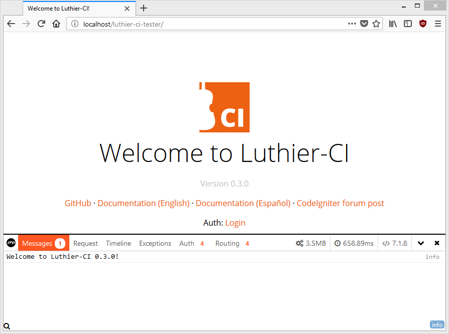
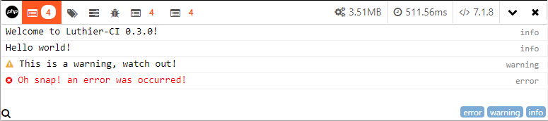

# 调试 Debug

<div class="alert alert-warning">
    <i class="fa fa-warning" aria-hidden="true"></i>
    <strong>实验功能 </strong>
    <br />
    我们已经努力使事情正常工作，但是可能会出现错误，导致和/或收取此功能所需的资产。如果您在使用过程中发生过事故，<a href="https://github.com/ingeniasoftware/luthier-ci/issues/new">请通知我们。</a> 
</div>

### 内容 Contents

1. 介绍 [Introduction](#introduction)
2. 激活 [Activation](#activation)
3. 调试消息 [Debug messages](#debug-messages)
4. 添加您自己的数据收集器 [Add your own data collectors](#add-your-own-data-collectors)


### <a name="introduction"></a> 介绍 Introduction

由于将Luthier CI与这个出色的工具集成在一起，您可以将[PHP Debug Bar](http://phpdebugbar.com) 添加到您的应用程序中。

### <a name="activation"></a> 激活 Activation

要激活此功能（默认情况下已禁用），请转到您的 `application/config/hooks.php` 文件并替换：

```php
<?php
# application/config/hooks.php

defined('BASEPATH') OR exit('No direct script access allowed');

// (...)

$hook = Luthier\Hook::getHooks();
```

附：

```php
<?php
# application/config/hooks.php

defined('BASEPATH') OR exit('No direct script access allowed');

// (...)

$hook = Luthier\Hook::getHooks(
    [
        'modules' => ['debug']
    ]
);
```

您应该在窗口底部看到调试栏：

<p align="center">
    
</p>

### <a name="debug-messages"></a> 调试消息 Debug messages

要添加调试消息，请使用该类的 `log()` 静态方法 `Luthier\Debug`:

```php
# use Luthier\Debug;
Debug::log($variable, $type, $dataCollector);
```

`$variable` 要调试的变量在哪里，并且 `$type` 是消息的类型，可以是 `'info'`, `'warning'` 或 `'error'`.

例：

```php
<?php
# application/controllers/TestController.php

use Luthier\Debug;

defined('BASEPATH') OR exit('No direct script access allowed');

class TestController extends CI_Controller
{
    public function index()
    {
        Debug::log('Welcome to Luthier-CI ' . LUTHIER_CI_VERSION . '!');
        Debug::log('Hello world!','info');
        Debug::log('This is a warning, watch out!','warning');
        Debug::log('Oh snap! an error was occurred!','error');
        $this->load->view('welcome_message');
    }
}
```

结果如下：

<p align="center">
    
</p>

可选 `$dataCollector` 参数是将存储消息的 [data collector](http://phpdebugbar.com/docs/data-collectors.html) 的名称

```php
Debug::log('Custom data collector','error','my_custom_data_collector');
```

如果需要存储要在下一个请求中显示的消息（例如，在提交表单后），请使用该`logFlash()` 方法，其语法与 `log()` 静态方法相同：

```php
Debug::logFlash('Hey! this will be available in the next request','info');
```

<div class="alert alert-success">
    <i class="fa fa-check" aria-hidden="true"></i>
    <strong>在生产环境中取消激活 </strong>
    <br />
    如果将应用程序的环境设置<code>production</code> 为此功能将自动禁用，并且将忽略任何调试代码
</div>

<div class="alert alert-warning">
    <i class="fa fa-warning" aria-hidden="true"></i>
    <strong>要求输出缓冲区中有数据</strong>
    <br />
    Luthier CI 在输出缓冲区中添加PHP Debug Bar代码，然后由 <code> output</code> CodeIgniter库处理并发送到浏览器。因此，必须至少使用一次函数<code>$this->load-> view()</code> 或明确定义输出缓冲区才能工作。该<code>echo</code> 语句不产生任何内部输出缓冲器。此外，使用函数停止执行脚本 <code>die</code> 或 <code>exit</code> 将阻止显示PHP调试栏。
</div>

### <a name="add-your-own-data-collectors"></a> 添加您自己的数据收集器  ( Add your own data collectors )

可以添加自己的数据收集器并在其中存储消息。要将数据收集器添加到PHP Debug Bar实例，请使用`addCollector()` static方法：

```php
# use Luthier\Debug;
Debug::addCollector(new MyCollector());
```